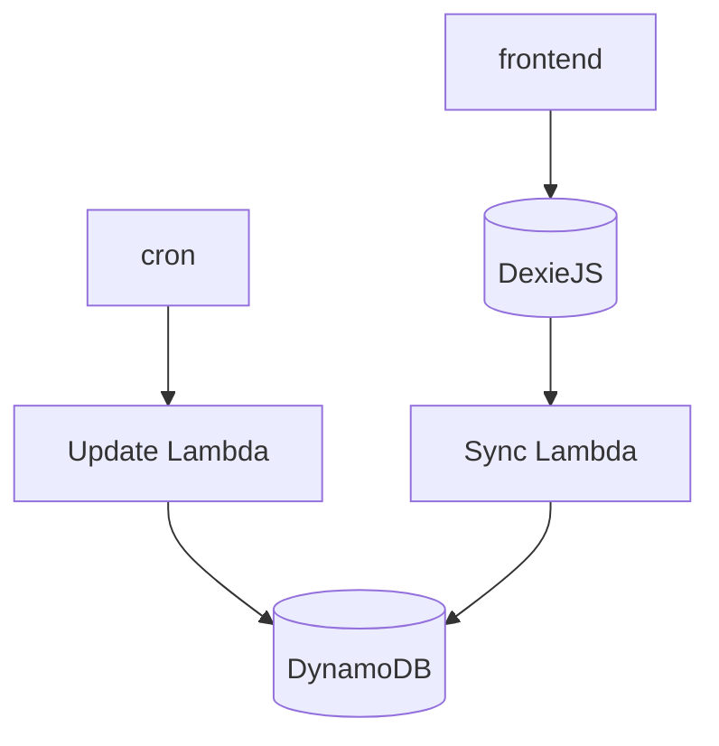

# cloudy-rss

Serverless RSS reader

Requirements
- Login with OIDC, frontend-only
- Email allowlist for logins
- Add feeds to sync
- Refresh my feeds
- Mark items read/unread
- Local-first, cache feed (and everything else), make sure its usable offline (e.g. airplane)
- PWA, Mobile friendly

Technical requirements
- Cheap scale-down - DynamoDB, Lambda

## Sketch architecture

 ## Tech stack

### Frontend

 - SvelteKit (SPA adapter) - https://kit.svelte.dev/
 - Flowbite (tailwind based) - https://flowbite-svelte.vercel.app/
 - DexieJS + Dexie Sync - https://github.com/dexie/Dexie.js
 - OpenID via oidc-client-ts and google auth - https://github.com/authts/oidc-client-ts

 ### Infra
 - SST - https://sst.dev/
 - AWS
  - DynamoDB
  - Lambda

 ### Backend
 - TypeScript
 - ElectroDB - https://electrodb.dev/

## Development setup

SST uses your current AWS profile to deploy a development instance of everything. 
The region is currently hardcoded to `eu-west-2` (London)

The only bit of configuration you will need is a Google OpenID application. To set that up:

1. Create a new OpenID application with Google at https://console.cloud.google.com/apis/credentials/oauthclient
2. Copy the `.env.example` to `.env.local` and fill in the credentials from the above

### Running

To start the backend in development mode, use `npm run dev`

To start the frontend in development mode, use `cd packages/frontend && npm run dev`

If anything goes wrong with the backend stack, you can use `npm run sst remove`
