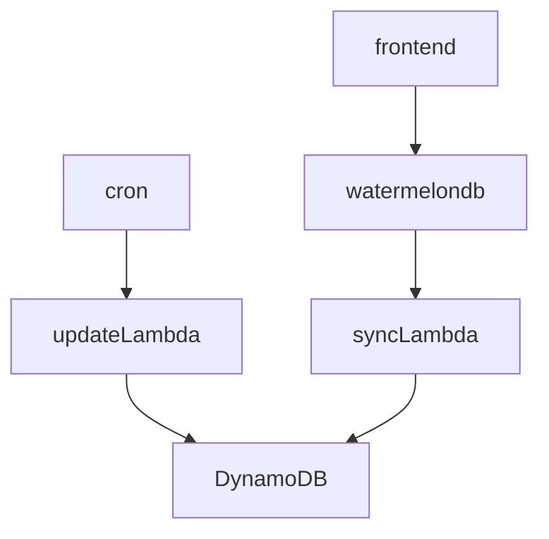

# cloudy-rss

Serverless RSS reader

Requirements
- Login with OIDC, frontend-only
- Email allowlist for logins
- Add feeds to sync
- Refresh my feeds
- Mark items read/unread
- Offline-first, cache feed (and everything else) locally
- Mobile friendly

Technical requirements
- Cheap scale-down - DynamoDB, Lambda

## Architecture

 ## Tech stack

### Frontend

 - SvelteKit (SPA adapter) - https://kit.svelte.dev/
 - SkeletonUI (tailwind based) - https://www.skeleton.dev/
 - WatermelonDB - https://watermelondb.dev/
 - OpenID - TODO

 ### Infra
 - IaC via SST - https://sst.dev/
 - AWS
  - DynamoDB
  - Lambda

 ### Backend
 - TypeScript
 - ElectroDB - https://electrodb.dev/